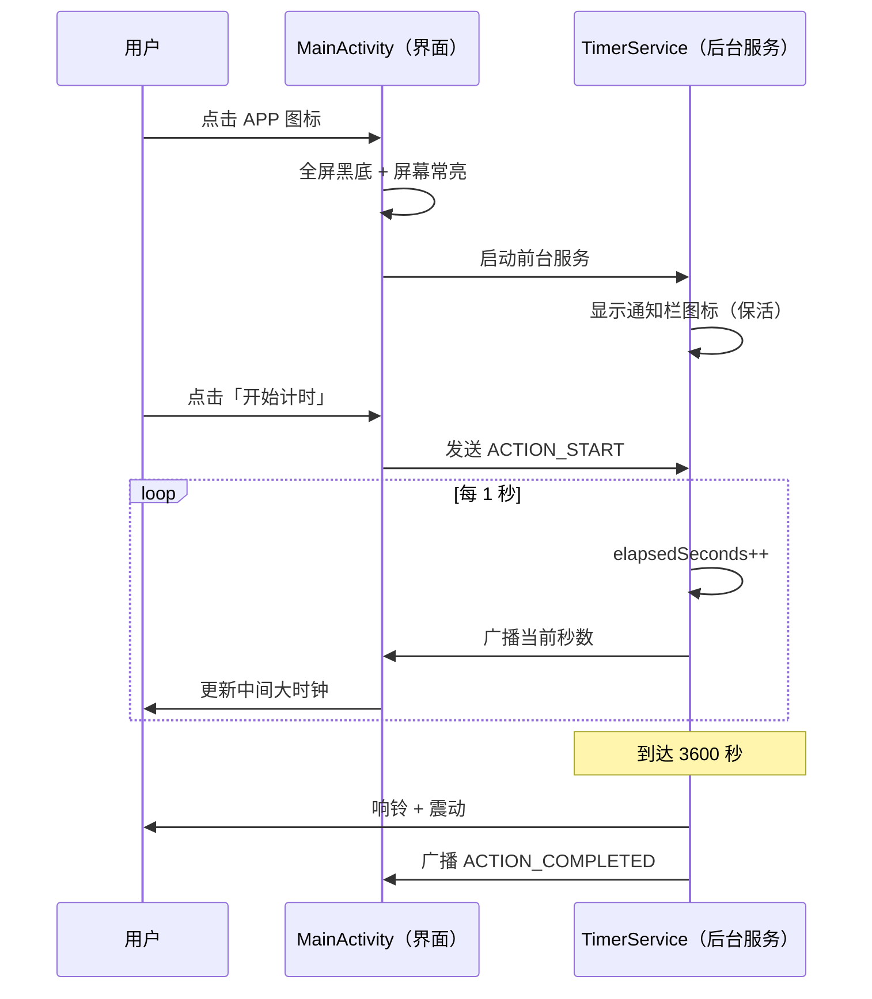

# 全屏屏保 60 分钟专注计时器 — 架构说明

> 本文档面向零基础用户，说明本 APP 的代码结构、各文件职责，以及打开 APP 后内部发生了什么。  
> 代码文件内已补充中文注释，可对照阅读。

---

## 一、整体架构：两个角色分工

本 APP 采用经典的 **「界面 + 后台服务」** 架构，可以类比成一家小店：

```
┌─────────────────────────────────────────────────────────┐
│                    你的手机                              │
│                                                         │
│   ┌──────────────────┐         ┌──────────────────┐    │
│   │   MainActivity   │  指令   │   TimerService   │    │
│   │   （前台服务员）  │ ──────→ │   （后厨厨师）    │    │
│   │                  │         │                  │    │
│   │  · 显示界面      │  广播   │  · 真正计时 +1   │    │
│   │  · 响应按钮      │ ←────── │  · 到点响铃震动   │    │
│   │  · 刷新系统时间  │         │  · 后台不被杀     │    │
│   └──────────────────┘         └──────────────────┘    │
│            ↑                              ↑             │
│     activity_main.xml              通知栏小图标          │
│     （界面布局文件）                                      │
└─────────────────────────────────────────────────────────┘
```

| 文件 | 角色 | 干什么 |
|------|------|--------|
| `MainActivity.kt` | 前台界面 | 你看到的黑屏、时钟、按钮 |
| `TimerService.kt` | 后台服务 | 真正跑秒、到点提醒 |
| `activity_main.xml` | 界面蓝图 | 控件放哪、多大、什么颜色 |
| `AndroidManifest.xml` | APP 身份证 | 注册页面/服务、声明权限 |

---

## 二、打开 APP 后发生了什么

按时间线理解：

1. **打开 APP** → `MainActivity` 启动 → 全屏黑底、屏幕常亮
2. **同时** → 启动 `TimerService` → 通知栏出现小图标（告诉系统别杀我）
3. **点「开始」** → 界面发指令给 Service → Service 每秒 +1
4. **每秒** → Service 广播进度 → 界面更新中间大时钟
5. **满 60 分钟** → Service 响铃震动 → 自动停止

### 时序图



---

## 三、为什么非要两个文件？不能只写一个吗？

可以只写一个文件，但会有问题：

| 场景 | 只有 Activity | Activity + Service |
|------|--------------|-------------------|
| APP 在前台 | 正常计时 | 正常计时 |
| 切到别的 APP | 可能被系统暂停/杀掉，计时会停 | Service 继续跑 |
| 锁屏 | 可能中断 | 继续跑 |
| 到点提醒 | 界面不在时可能不响 | Service 照样响铃震动 |

**Service + 前台通知** = 跟系统说：「我在干活，别杀我。」

---

## 四、通信方式：指令 + 广播

两部分通过两种「暗号」沟通。

### 界面 → 服务（你点了按钮）

| 指令常量 | 含义 |
|----------|------|
| `ACTION_START` | 开始/继续计时 |
| `ACTION_PAUSE` | 暂停 |
| `ACTION_RESET` | 重置归零 |
| `ACTION_QUERY_STATE` | 问一声「现在多少秒了？」 |

### 服务 → 界面（每秒汇报进度）

| 事件常量 | 含义 |
|----------|------|
| `ACTION_TICK` | 正常跑秒，带上当前秒数 |
| `ACTION_COMPLETED` | 60 分钟到了 |

### 广播携带的数据字段

| 字段名 | 含义 |
|--------|------|
| `EXTRA_ELAPSED_SECONDS` | 已计多少秒 |
| `EXTRA_IS_RUNNING` | 是否在跑 |
| `EXTRA_IS_COMPLETED` | 是否已完成 |

---

## 五、项目文件结构

```
android-app/
├── AndroidManifest.xml              ← APP 身份证（权限、页面、服务注册）
├── app/src/main/
│   ├── res/layout/
│   │   └── activity_main.xml        ← 界面长相（黑底、两个时钟、三个按钮）
│   ├── res/values/
│   │   ├── strings.xml              ← 文字（按钮名、通知文案）
│   │   ├── colors.xml               ← 颜色（黑底白字）
│   │   └── themes.xml                 ← 主题（全屏样式）
│   └── java/com/focus/timer/
│       ├── MainActivity.kt            ← 界面逻辑（显示、按钮、全屏）
│       └── TimerService.kt            ← 计时核心（跑秒、响铃、保活）
└── 架构说明.md                        ← 本文档
```

---

## 六、三个按钮背后的逻辑

```
【开始】→ isRunning=true  → 每秒 +1  → 界面刷新
【暂停】→ isRunning=false → 冻结秒数 → 界面停住
【重置】→ 全部归零       → 停止铃声 → 回到 00:00:00
```

### 按钮可用规则（`updateButtonStates()`）

- **正在计时** → 「开始」灰掉，「暂停」可点
- **已跑满 60 分钟** → 「开始」灰掉，只能「重置」
- **有进度或已完成** → 「重置」可点

---

## 七、两个时钟的区别

| 时钟 | 谁负责刷新 | 数据来源 |
|------|-----------|----------|
| 上方：当前系统时间 | MainActivity 自己 | 手机系统 `Date()` |
| 中间：已计时时长 | MainActivity 显示，Service 提供数据 | `elapsedSeconds` |

上方时钟跟专注无关，所以放在 Activity 里每秒刷新即可。  
中间时钟是核心，数据以 **Service 为准**。

---

## 八、权限说明

| 权限 | 用途 |
|------|------|
| `VIBRATE` | 到 60 分钟时震动提醒 |
| `FOREGROUND_SERVICE` | 允许前台服务在后台持续运行 |
| `FOREGROUND_SERVICE_SPECIAL_USE` | Android 14 计时类前台服务声明 |
| `POST_NOTIFICATIONS` | Android 13+ 显示前台通知（用户可拒绝，计时仍可用） |

本 APP **不需要联网**，无广告，无多余权限。

---

## 九、核心类职责速查

### MainActivity.kt

- 显示全屏屏保 UI（黑底、双时钟、三个按钮）
- 每秒刷新手机当前系统时间
- 把用户的按钮操作转发给 TimerService
- 接收 Service 广播，更新计时时长显示
- **不负责**真正的计时逻辑

### TimerService.kt

- 维护计时状态（秒数、运行/暂停/完成）—— 整个 APP 的「唯一真相」
- 每秒 +1，到 3600 秒自动停止并响铃震动
- 通过广播把最新状态通知给 MainActivity
- 在通知栏显示低调的运行中提示
- 使用 `START_STICKY`，被系统意外杀掉后会尝试自动重启

---

## 十、打包与安装（简要）

1. 用 Android Studio 打开本项目文件夹
2. 等待 Gradle 同步完成
3. 菜单：**Build → Build Bundle(s) / APK(s) → Build APK(s)**
4. APK 路径：`app/build/outputs/apk/debug/app-debug.apk`
5. 拷贝到手机安装即可

---

## 十一、一句话总结

> **MainActivity 负责「看和点」，TimerService 负责「算和响」。**  
> 界面通过 **Intent 指令** 控制服务，服务通过 **广播** 回报进度。

有空时建议阅读顺序：

1. `activity_main.xml` — 先看界面长什么样
2. `MainActivity.kt` — 再看界面怎么工作
3. `TimerService.kt` — 最后看计时核心逻辑
4. `AndroidManifest.xml` — 了解权限和组件注册
